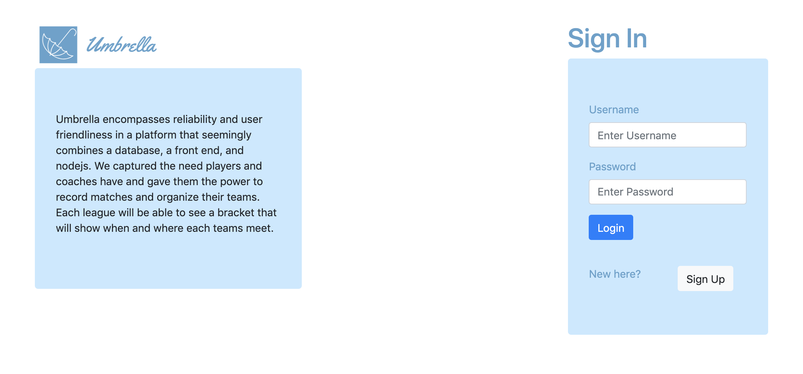

# 3308 Project

We are creating a sports management application which can be joined by “coaches” and “team members”, 
where coaches create teams and team members join the teams. Then matches can be organized 
between the teams by a message board. You can submit time, date, and location and it'll display it onto the page.
We've user HTML, CSS, Javascript, MySQL, PUG, Node Js, and Bootstrap.

## Getting Started

To run these files locally you can clone or download our repo.
Then you do npm start in your terminal and go 
to google chrome/safari and do http://localhost:80/

or

You can go to 104.43.219.124 in your favorite browser

## Prerequisites

This application can work on a Mac and a Linux machine.

## Organization

We have folder for our HTML, CSS, JavasScript and img.

## Testing

User Acceptance Testing
(In project Milestone 7)

